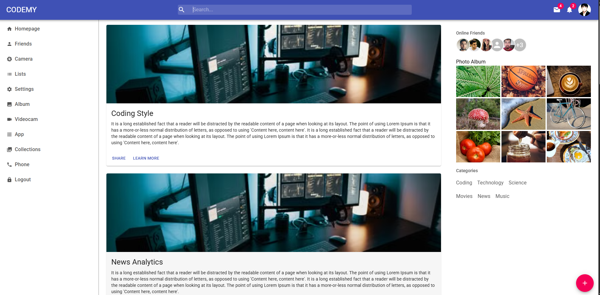

# Codemy – Material UI Social Dashboard

A responsive social-media style dashboard built with **React** and **Material UI**. It has a top navbar with search and notifications, a sidebar menu, a feed of post cards, and a right panel with online friends, a photo album and categories.

## Preview



## Features

- **Navbar** – brand logo, search bar, mail/notification badges and user avatar
- **Left sidebar** – navigation links (Homepage, Friends, Camera, Lists, Settings, Album, and more)
- **Feed** – post cards with image, title, description and action buttons
- **Right bar** – online friends (avatar group), photo album grid and category links
- **Floating add button** – quick action to create a new post

## Tech Stack

- React 17
- Material UI v4 (`@material-ui/core`, `@material-ui/icons`, `@material-ui/lab`)
- Create React App

## Getting Started

```bash
npm install
npm start
```

Then open [http://localhost:3000](http://localhost:3000) in your browser.

To create a production build:

```bash
npm run build
```

## Project Structure

```
src/
├── App.js
├── theme.js
└── components/
    ├── Navbar.jsx
    ├── Leftbar.jsx
    ├── Feed.jsx
    ├── Post.jsx
    ├── Rightbar.jsx
    └── Add.jsx
```
